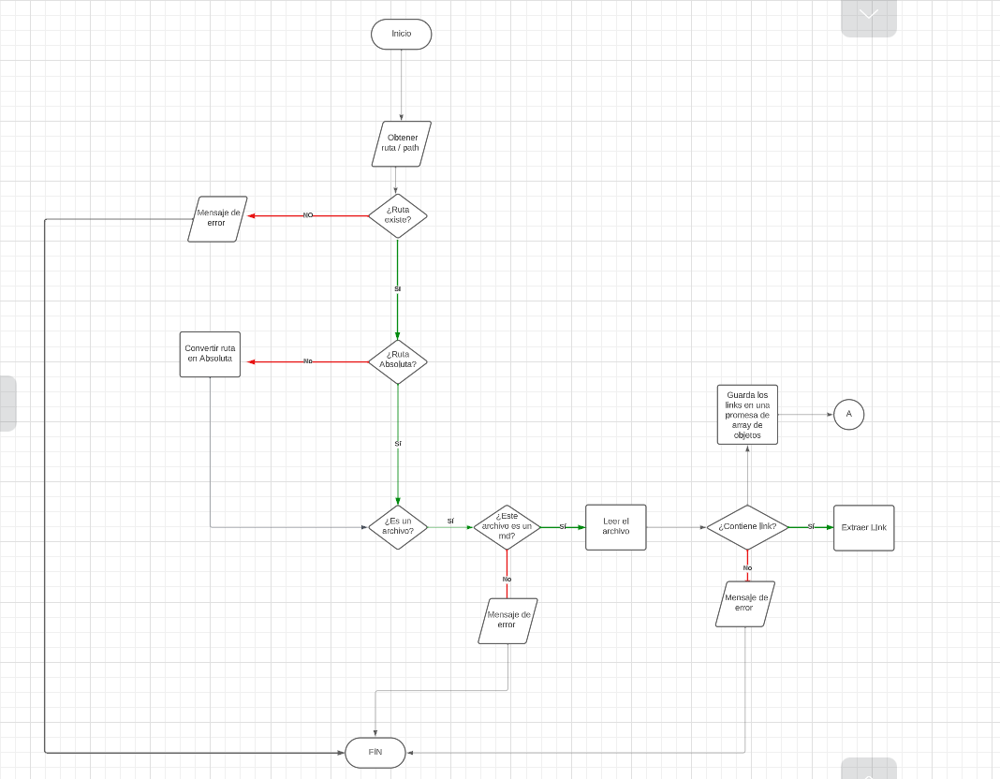
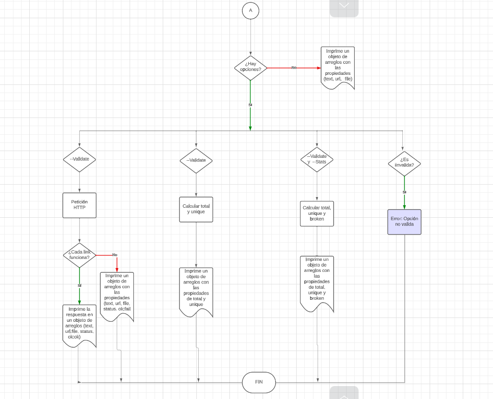
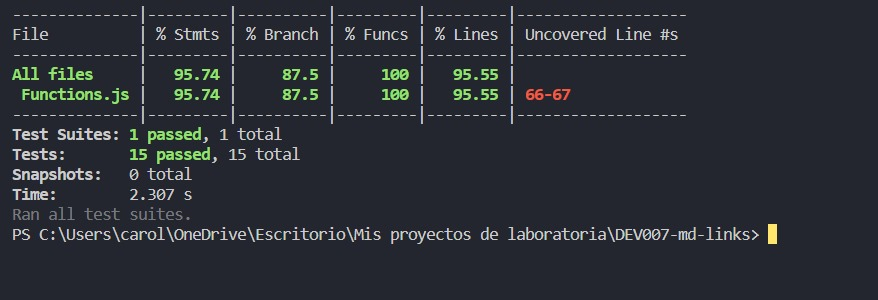

# Markdown Links

## Índice

* [1. Preámbulo](#1-preámbulo)
* [2. Resumen del proyecto](#2-resumen-del-proyecto)
  * [2.1. JavaScript API](#21-javascript-api)
  * [2.2. Interfaz de Línea de Comando - CLI](#22-interfaz-de-línea-de-comando---cli)
* [3. Diagrama de flujo](#3-diagrama-de-flujo)
* [4. Test unitarios](#4-test-unitarios)


***

## 1. Preámbulo

[Markdown](https://es.wikipedia.org/wiki/Markdown) es un lenguaje de marcado que facilita la aplicación de formato a un texto empleando una serie de caracteres de una forma especial.

Fue creado por John Gruber y Aaron Swartz en 2004 con el objetivo de facilitar 
la escritura y la lectura de documentos de texto que luego se pueden convertir 
fácilmente en documentos HTML u otros formatos. 

Es usado en muchísimas plataformas que
manejan texto plano (GitHub, foros, blogs, ...) y es muy común
encontrar varios archivos en ese formato en cualquier tipo de repositorio
(empezando por el tradicional `README.md`).

## 2. Resumen del proyecto

Estos archivos `Markdown` normalmente contienen _links_ (vínculos/ligas) que
muchas veces están rotos o ya no son válidos y eso perjudica mucho el valor de
la información que se quiere compartir.

En este proyecto crea una herramienta de línea de comando (CLI) usando [Node.js](https://nodejs.org/),que lea y analice archivos en formato `Markdown` para verificar los links que contengan y reportar algunas estadísticas. Así mismo, se desarrolla una librería en JavaScript, esta librería consta de DOS partes:

## 2.1. JavaScript API

### ● Instalación

Abre una terminal o línea de comandos en tu sistema operativo y ejecuta el siguiente comando:
```
npm install carolinacajas-md-links
```
### ● Uso

La librería puede importarse en otros scripts de Node.js y ofrece la siguiente interfaz:

#### `mdLinks(path, options)`

##### Argumentos

* `path`: Ruta **absoluta** o **relativa** al **archivo** o **directorio**.
* `options`: Un objeto con las siguientes propiedades:
  - `validate`: Booleano que determina si se desea validar los links encontrados.
  - `stats`: Booleano que determina si se desean obtener estadísticas de los enlaces.
    
##### Valor de retorno

La función retorna una promesa (`Promise`) que resuelve un arreglo (`Array`) de objetos (`Object`), donde cada objeto representa un link y contiene
las siguientes propiedades

Con `validate:false` :

* `href`: URL encontrada.
* `text`: Texto que aparecía dentro del link (`<a>`).
* `file`: Ruta del archivo donde se encontró el link.

Con `validate:true` :

* `href`: URL encontrada.
* `text`: Texto que aparecía dentro del link (`<a>`).
* `file`: Ruta del archivo donde se encontró el link.
* `status`: Código de respuesta HTTP.
* `ok`: Mensaje `fail` en caso de fallo u `ok` en caso de éxito.

## 2.2. Interfaz de Línea de Comando - CLI

### ● Uso

El ejecutable puede ejecutarse de la siguiente manera a través de la **terminal**:

`md-links <path-to-file> [options]`

Por ejemplo:

```sh
$ md-links ./some/example.md
./some/example.md http://algo.com/2/3/ Link a algo
./some/example.md https://otra-cosa.net/algun-doc.html algún doc
./some/example.md http://google.com/ Google
```

El comportamiento por defecto no valida si las URLs responden ok o no, solo identifica el archivo markdown (a partir de la ruta que recibe como
argumento), analiza el archivo Markdown e imprime los links que vaya encontrando, junto con la ruta del archivo donde aparece y el texto que hay dentro del link.

#### Options

##### `--validate`

Si se incluye la opción `--validate`, el módulo hace una petición HTTP para averiguar si el link funciona o no. Si el link resulta en una redirección a una URL que responde ok, entonces se considera el link como ok.

Por ejemplo:

```sh
$ md-links ./some/example.md --validate
./some/example.md http://algo.com/2/3/ ok 200 Link a algo
./some/example.md https://otra-cosa.net/algun-doc.html fail 404 algún doc
./some/example.md http://google.com/ ok 301 Google
```

En este caso el _output_ incluye la palabra `ok` o `fail` después de la URL, así como el status de la respuesta recibida a la petición HTTP a dicha
URL.

##### `--stats`

Si se incluye la opción `--stats` el output (salida) será un texto con estadísticas básicas sobre los links.

```sh
$ md-links ./some/example.md --stats
Total: 3
Unique: 3
```

También es posible combinar `--stats` y `--validate` para obtener estadísticas que necesiten de los resultados de la validación.

```sh
$ md-links ./some/example.md --stats --validate
Total: 3
Unique: 3
Broken: 1
```
## 3. Diagrama de flujo





## 4. Test unitarios

Pruebas unitarias cubren el 95.74% de statements, 100% functions, 95.55% lines, y 85.5% branches.




